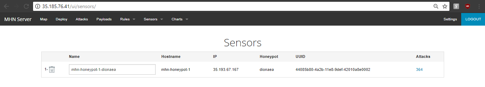
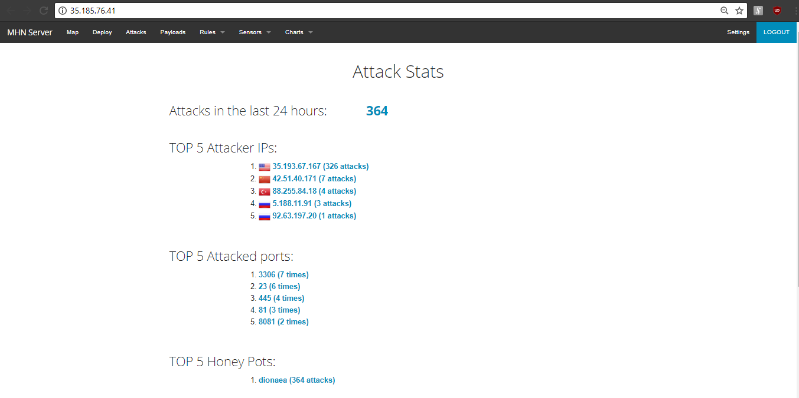

# Project 9 - Honeypot

Time spent: **8** hours spent in total

> Objective: Setup a honeypot and intercept some attempted attacks using dummy server.

# Details on the Experiment
1. Which Honeypot(s) you deployed?  
  
I only needed to deploy 1 honeypot, because it was already getting a lot of attacks.  
  
### Honeypot Created
  
  
    
2. Any issues you encountered?  
  
Unusually enough I had a problem when I ran the:
```
./install.sh
```
from https://github.com/RedolentSun/mhn.git.  
What made this so unusual was that this was done on a remote server, so it should have reproduced the same result for all servers,
but it gave me errors regarding to mangoDB. However, I fixed it after running it three times.  
  
I also found it confusing as when a second email was sent by our TA regarding to the setup.  
It should have been further clarified that the setup sent to us was a MHN setup that constitude a portion of the assignment.  
  
    
3. A summary of the data collected: number of attacks, number of malware samples, etc...  
  
There were several attacks while running this honeypot. It was notable that it mostly came from the server: 35.193.67.167
  
### Attacks
  
  
We were also able to honeypots that intercepted attacks .
  
### Attack Report
  
  
As for the malwares, no malwares were found.  
  
     
4. Any unresolved questions raised by the data collected.  
  
None.
